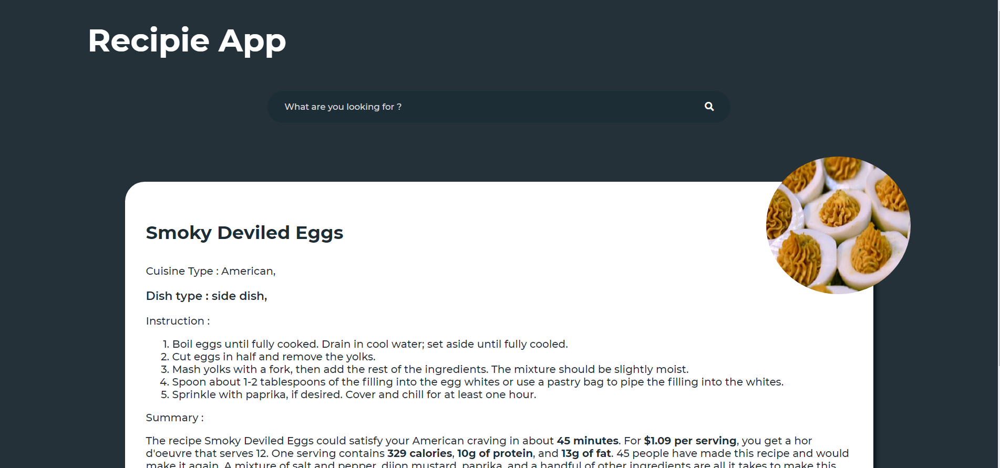
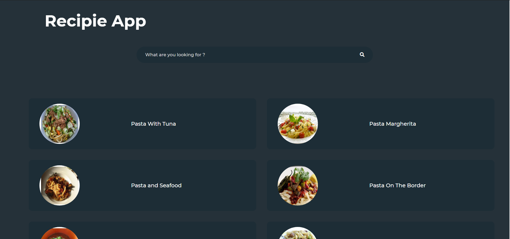
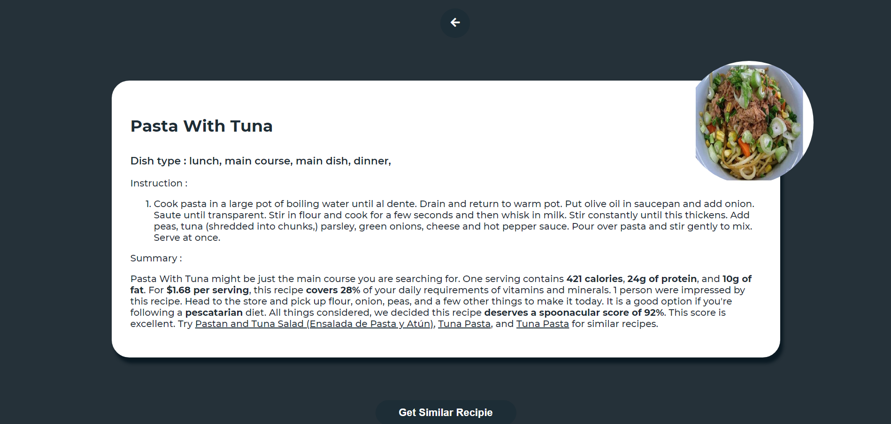
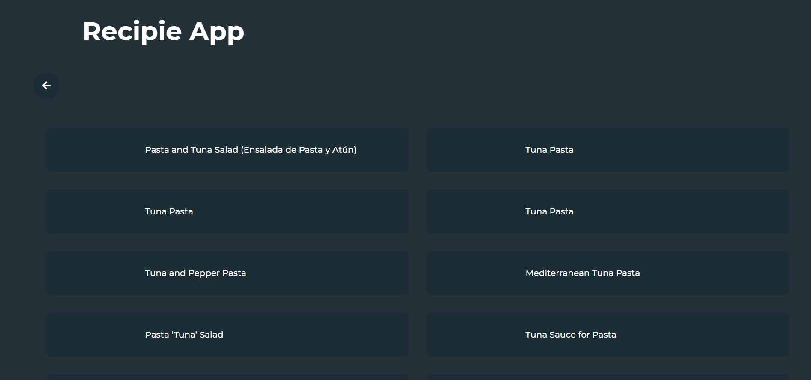

# React Recipe App

This project was built using react, spoonacular api and hosted on netlify.

##

```
NPM packages used
- react
- axios
- html-react-parser
- react-hot-toast
- react-router-dom
```

For Live demo, [click here:](https://recipie-search-app.netlify.app/)

## Screenshots





